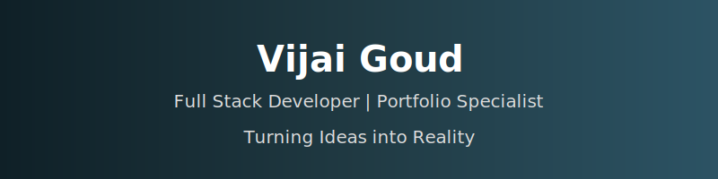
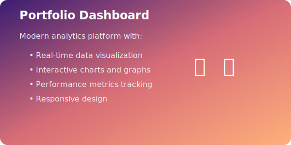

  

  

  
  
  
  
  
  
  

## 🚀 About Me
Innovative and detail-oriented developer passionate about creating impactful solutions. I specialize in turning complex problems into simple, beautiful, and intuitive designs. With a strong foundation in web technologies and a keen eye for user experience, I strive to build applications that make a difference.

## 💻 Technical Skills

### Frontend Development
- 🎨 HTML5, CSS3, JavaScript
- 📱 Responsive Design
- 🎯 UI/UX Best Practices

### Tools & Technologies
- 🔄 Version Control (Git)
- 🌐 GitHub
- 🛠️ Web Development Tools

### Soft Skills
- 🧩 Problem Solving
- 👥 Team Collaboration
- 📚 Continuous Learning
- 🔍 Attention to Detail

## 🌟 Featured Projects

### Portfolio Dashboard

  

A sophisticated dashboard for tracking and analyzing portfolio performance.

**Key Features:**
- 📊 Interactive data visualization
- 🔄 Real-time updates
- 📱 Responsive design
- 🎯 Performance analytics

## 📊 GitHub Analytics

  
  
  
  
  
  
  
  

## 📫 Let's Connect

  
  
  
  
  

---

  
  
  ### 🎵 Currently Coding To
  

